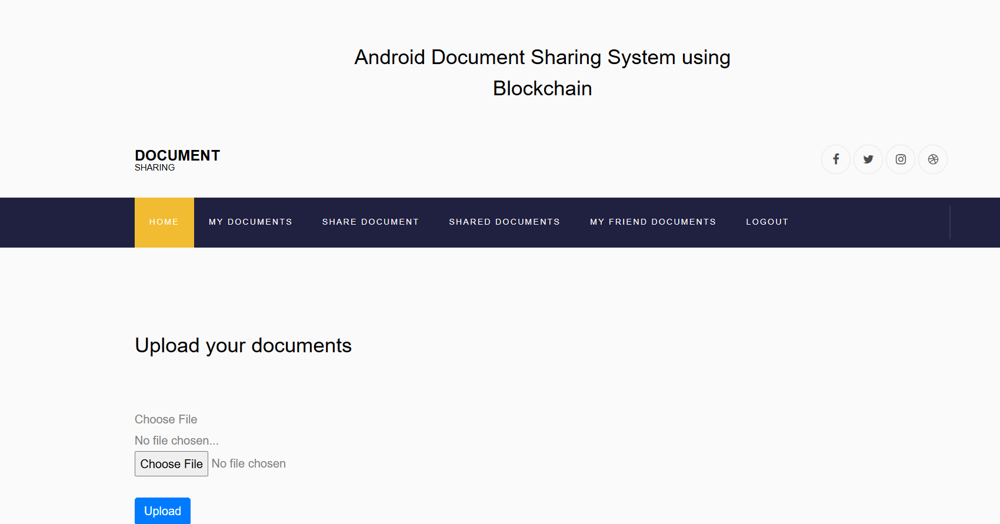
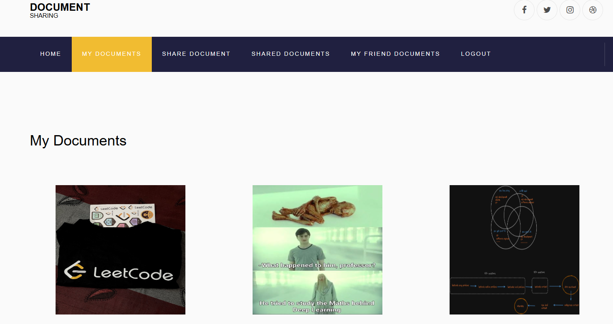

# **Document Sharing System with Blockchain Integration**

This project is a secure and decentralized document-sharing platform built on blockchain technology. It allows users to create accounts, upload and download documents, and securely share them. The use of blockchain ensures transparency, immutability, and enhanced security for document transactions.

## **How Blockchain is Used in This Project**

Blockchain technology is integrated to ensure the security, transparency, and immutability of documents shared on the platform. Here's how blockchain is implemented:

- **Decentralized Document Storage**:  
  Rather than storing documents on a traditional server, documents are stored on the blockchain, ensuring that once a document is uploaded, it cannot be altered or deleted, guaranteeing its authenticity.

- **Transaction Record**:  
  Each document upload and download is recorded as a transaction on the blockchain. This adds an additional layer of accountability and ensures that every action involving a document is logged securely.

- **Security & Immutability**:  
  Blockchain's decentralized nature means that documents are distributed across multiple nodes, reducing the risk of data tampering or loss. Every document uploaded is hashed and the hash is stored on the blockchain, ensuring that the document's integrity is preserved.

- **Smart Contracts for Document Sharing**:  
  Smart contracts are used to manage permissions for document sharing. They ensure that only authorized users can access or modify documents, and enforce predefined rules for document sharing based on user interactions.

## **Features**

- **Blockchain Integration**:  
  Documents are stored securely on the blockchain, ensuring transparency, immutability, and tamper-proof storage.

- **Account Creation**:  
  Users can create an account by filling in the required details, with all actions recorded on the blockchain.

- **Document Uploading**:  
  Users can upload documents, which are securely stored on the blockchain. The system records metadata, such as document hashes, ensuring that the uploaded documents are immutable.

- **Document Sharing**:  
  Documents can be shared between users, with blockchain technology guaranteeing the integrity and security of the shared files.

- **Document Downloading**:  
  Users can download documents that have been shared by other users. Blockchain ensures that these documents have not been tampered with.

- **User Authentication**:  
  Users are authenticated using JWT (JSON Web Tokens), ensuring secure login and session management.

## **Screenshots**:

## **Tech Stack**:
  - Blockchain: Ethereum, Smart Contracts
  - Backend: Node.js, Express
  - Frontend: React
  - Authentication: JWT (JSON Web Tokens)
  - Database: MongoDB (for user data and metadata)
  - Web3: For interacting with the blockchain

---
